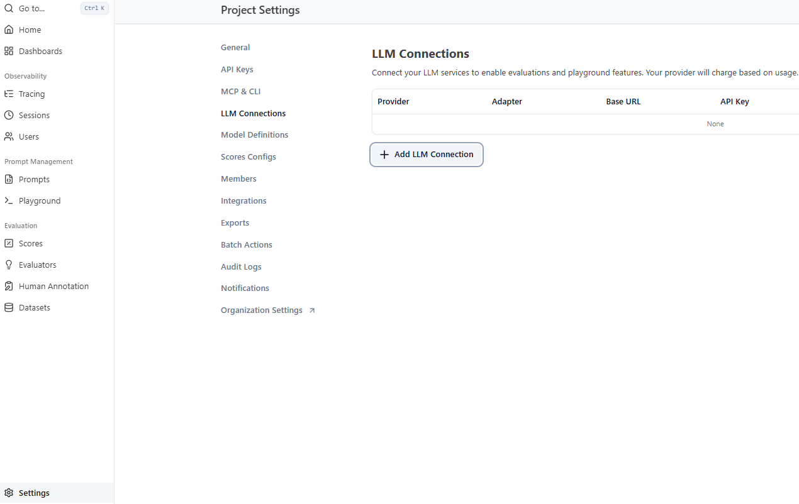
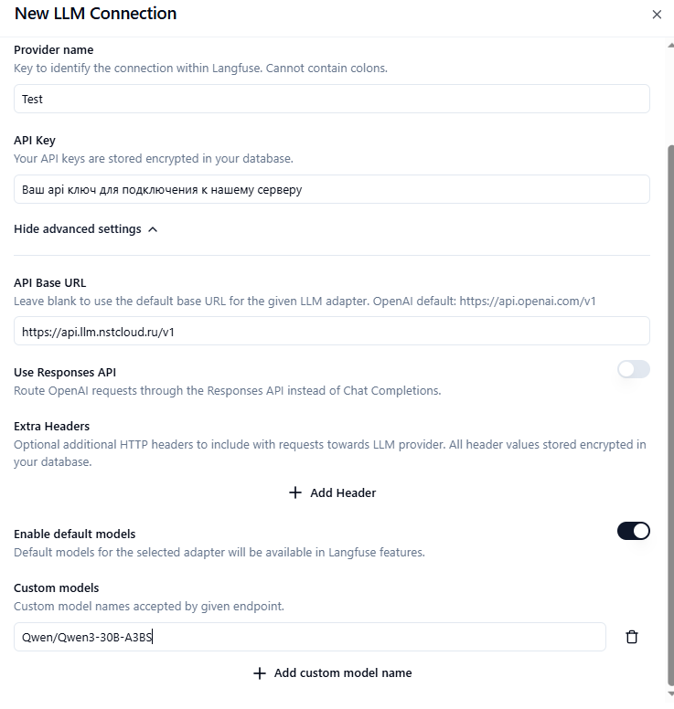
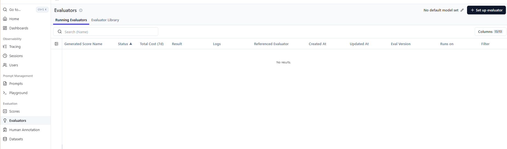
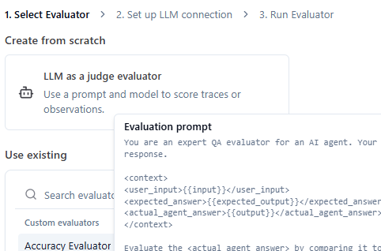
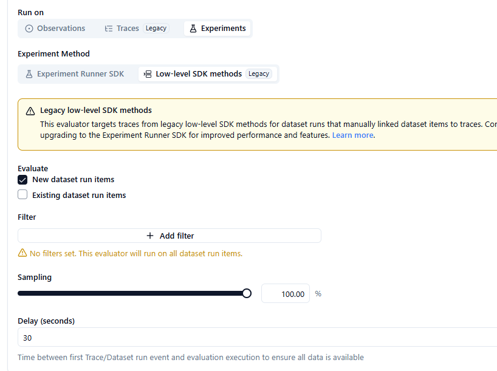
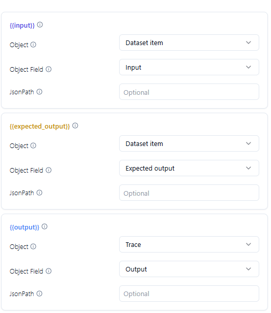
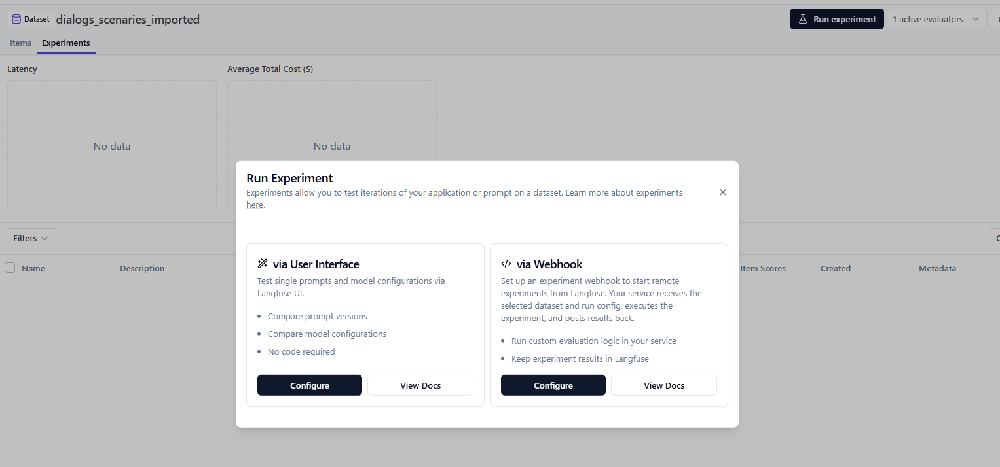
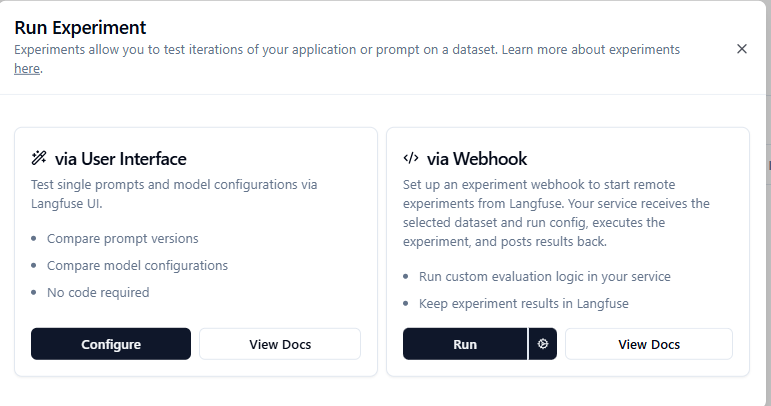

Краткая справка по Langfuse также доступна на [Яндекс Вики](https://wiki.yandex.ru/homepage/proizvodstvo/issledovanija/langfuse-vozmozhnosti-i-funkcional/)
# Пошаговая инструкция по локальному запуску и настройке Langfuse
## Шаг 1. Локальный запуск Langfuse
Для запуска тестов локально выполните следующие действия: 
1. Склонируйте репозиторий: 
    ```
    git clone --depth=1 https://github.com/langfuse/langfuse.git
    ```
2. Перейдите в созданную папку    
    ```
    cd langfuse
    ```
3. Замените содержимое стандартного файла docker-compose.yml на содержимое нашего файла langfuse_docker-compose.yml (оригинальный файл можно оставить, только если вы уверены в отсутствии конфликтов портов)
4. Запустите рабочую версию контейнера командой
    ```    
    docker compose up
    ```
## Шаг 2. Авторизация и получение API-ключей
1. Перейдите в веб-интерфейс контейнера по адресу: http://localhost:3000
2. Авторизуйтесь, создайте новую организацию (название значения не имеет) 
3. Сразу после создания организации начнется создание проекта (название также не имеет значения)
4. После создания появится окно создания ключей 
5. Нажмите Create new API key и скопируйте получившиеся значения прямо в ваш файл .env


## Шаг 3. Экспорт и импорт датасетов
* для экспорта датасетов настроить правильно пути в файле `export_dataset.py` и можно выгружать вот пример как правильно может выглядеть запуск: 
    ```
    (.venv) C:\Users\Igor\Desktop\project_links\Job NNT\asch-chat-bot>python agent/langfuse_files_scripts/export_dataset.py
    ```
* для импорта датасетов настроить правильно пути в файле `import_dataset.py` и можно импортировать датасет в langfuse, вот пример как правильно может выглядеть запуск: 
    ```
    (.venv) C:\Users\Igor\Desktop\project_links\Job NNT\asch-chat-bot>python agent/langfuse_files_scripts/import_dataset.py
    ```
## Шаг 4. Настройка LLM-оценщика в проекте
1. В настройках проекта задаем какая модель у нас будет: 


2. Задайте имя провайдера (произвольное название для идентификации), подставьте API key, а также укажите API для подключения модели и её имя 
    ```
    https://api.llm.nstcloud.ru/v1
    ```
    

## Шаг 5. Создание и настройка Evaluator
1. Для создания оценщика запустите соответствующий скрипт 
    ```
    (.venv) C:\Users\Igor\Desktop\project_links\Job NNT\asch-chat-bot>python agent/langfuse_files_scripts/create_evaluator.py 
    ```
2. Перейдите на вкладку Evaluators в веб-интерфейсе и нажмите Set up Evaluator


3. В появившемся окне выберите созданный с помощью скрипта `Accuracy Evaluator`


4. Настройте параметры запуска (когда оценщику запускаться):

    * Run on Experiments
    * Low-level SDK methods
    * Evaluate - New dataset run items


5. В самом низу настройте `variable mapping`, чтобы модели понимали, как проводить оценку и на какие переменные ссылаться


После этого созданный оценщик будет автоматически подхватываться при запуске экспериментов

## Шаг 6. Запуск экспериментов через Webhook

Для подключения к webhook из интернета (если вы используете docker-compose в первозданном виде) необходимо предоставить публичный доступ к порту
1. На локальном хосте в терминале выполните команду
    ```
    lt --port 8003
    ```
2. Скопируйте получившуюся временную ссылку
3. Перейдите в раздел **Datasets**, откройте нужный датасет, выберите вкладку **Experiments**, нажмите **Run experiment** и выберите пункт **Configure via Webhook**
 
4. Вставьте туда скопированную ссылку
5. Нажмите Run для запуска эксперимента

