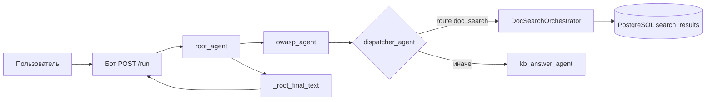

# Release notes: взаимодействие DocSearchOrchestrator, диспетчер и Telegram-бот

**Дата:** 2026-04-08  
**Область:** поиск документов (`doc_search`), маршрутизация (`dispatcher_agent`), интеграция с ADK и UI бота.

---

## Кратко

1. **`dispatcher_agent`** (через `root_agent`) решает, нужен ли **поиск по файлам** (`route: doc_search`) и передаёт **`intent`** и **`search_query`**.
2. **`DocSearchOrchestrator`** при `intent: doc_search` запускает **`doc_search_agent`** (LLM + MCP `kb_search`), валидирует JSON и при успехе **сохраняет полный список в PostgreSQL**; пользователю список **не формирует** — этим занимается **бот** по данным из БД.
3. **Бот** до вызова ADK обрабатывает **«ещё» / «все» / номера скачивания** локально из БД; после нового поиска сравнивает **`search_id`** и отправляет **первую порцию** через **`render_results`**.

---

## Цепочка в ADK (`root_agent`)

- Сообщение с префиксом **`Контекст пользователя:`** (синхронизация профиля из `AdkApiClient.set_user_state`) **не** запускает цепочку агентов — см. `utils.bot_adk_profile` и ранний выход в `root_agent`.
- Если в тексте есть **номера для скачивания**, диспетчер может быть **пропущен** или переопределён на **`file_download`** (см. `extract_download_ranks` в `root_agent`).
- Для коротких реплик **«все» / «ещё»** `root_agent` может **переопределить** результат диспетчера на **`show_more` / `show_all`**, если диспетчер не выбрал doc_search с этим intent.

---

## DocSearchOrchestrator

**Файл:** `agent/agents/doc_search_orchestrator.py`

| Этап | Поведение |
|------|-----------|
| Вход | Из `ctx.session.state`: `user_query`, `doc_search_intent`, `doc_search_search_query` (ставит `root_agent` из диспетчера). |
| `show_more` / `show_all` / `file_download` | Не вызывает LLM: в `_root_final_text` кладётся **текст-подсказка** (`_follow_up_unhandled_in_agent_hint`) — в нормальном сценарии Telegram **не доходит** сюда, т.к. бот обрабатывает эти команды **раньше** ADK. |
| `doc_search` | `run_json_leaf_agent` → **`doc_search_agent`** → **`validate_doc_search_result`**. |
| `mode != document_list` | Финальный текст пользователю (через root): **`message`** из ответа агента (например «ничего не найдено»). |
| `document_list` | Нормализация рангов, **`_root_final_text` = DOC_SEARCH_SUCCESS_HINT** (заглушка), **`_persist_full_list`** → **`save_doc_search_results`**. |

**Вспомогательные функции оркестратора**

| Функция | Назначение |
|---------|------------|
| `_telegram_user_id` | Достаёт `user_id` сессии ADK (совпадает с Telegram user id в `/run`). |
| `_persist_full_list` | Собирает строки для БД и вызывает **`save_doc_search_results`** (`utils.search_results_db`). |
| `_follow_up_unhandled_in_agent_hint` | Тексты-подсказки, если follow-up попал в оркестратор без клиентской обработки. |

---

## Диспетчер

**Файл:** `agent/agents/dispatcher_agent.py`

- Возвращает JSON: `status`, `route` (`doc_search` | путь к kb), `intent`, `reason`, `search_query`.
- Валидация: **`validate_dispatcher_result`**.
- **`root_agent`** записывает результат в **`_dispatcher_result_parsed`**, при `route == doc_search` прокидывает **`doc_search_intent`** и **`doc_search_search_query`** в state и вызывает **`DocSearchOrchestrator.run_async`**.

---

## Telegram-бот

**Файл:** `bot/services/handlers.py` (основной поток — `on_text`)

1. **`adk.ensure_session`** — сессия ADK для `user_id` / `session-{user_id}`.
2. **Без ADK:** если текст матчит **«ещё»** / **«все»** — **`handle_show_more`** / **`handle_show_all`** (`bot/services/utils.py`), работа с **`PostgresChatStore`** и метаданными поиска.
3. **Без ADK:** **`parse_download_ranks`** → **`handle_download_by_ranks`** (файлы по номерам из последнего списка в БД).
4. Иначе: при наличии профиля — **`adk.set_user_state`** (профиль; в агенте отфильтрован как не пользовательский ход).
5. **`adk.run`** — один запуск цепочки **`root_agent`**.
6. После ответа: если **`search_id`** изменился относительно значения до вызова — читается список из БД, **`render_results`** → **`m.answer`** (первая порция, HTML).
7. Иначе — обычный ответ модели (**`kb_answer`** и т.д.): очистка от служебных блоков, **`markdown_to_safe_html`** при необходимости.

**Функции бота / утилит (поиск документов)**

| Место | Функция | Назначение |
|-------|---------|------------|
| `bot/services/database.py` | `AdkApiClient.run` | POST `/run` с `new_message` пользователя. |
| | `AdkApiClient.set_user_state` | POST `/run` с system-сообщением профиля (префикс согласован с `root_agent`). |
| | `AdkApiClient.ensure_session` / `delete_session` | Создание / удаление сессии ADK. |
| `bot/services/utils.py` | `handle_show_more`, `handle_show_all` | Пагинация списка из БД, обновление `shown_count`. |
| | `handle_download_by_ranks` | Скачивание по рангу через **`store.get_result_by_rank`** и **`DocumentHandler`**. |
| | `render_results` | Обёртка над **`render_doc_list_html`** (`utils.doc_search_format`). |
| `utils/doc_search_format.py` | `parse_download_ranks`, `render_doc_list_html`, `strip_bot_search_meta`, … | Разбор номеров, HTML списка, служебная разметка. |
| `utils/search_results_db.py` | `save_doc_search_results`, … | Запись результатов поиска и смена **`search_id`**. |

---

## Агент поиска и валидация

| Компонент | Файл | Роль |
|-----------|------|------|
| `doc_search_agent` | `agent/agents/doc_search_agent.py` | LLM + MCP **`kb_search`**, выход в **`doc_search_result_json`**. |
| `validate_doc_search_result` | там же | Нормализация контракта (`document_list` / `no_data`, legacy `search_results`), фильтр **`is_relevant: false`**. |
| `run_json_leaf_agent` | `agent/json_leaf_runner.py` | Запуск leaf-агента, парсинг JSON из ответа, вызов валидатора, запись в `session.state`. |

---

## Конфигурация

- Размер первой порции и шаг при выводе «ещё»: **`DOC_SEARCH_PAGE_SIZE`** (грузится из env по `SHOW_LIST_SIZE` (`agent/config.py`)).
- Коллекция документов для `kb_search` в doc_search: **`ACTIVE_DOCUMENTS_COLLECTION`**, в оркестраторе — **`doc_collection`**.

---

## Итог по ответственности

| Кто | Что делает |
|-----|------------|
| **Dispatcher** | Классификация запроса: поиск файлов vs ответ из KB / smalltalk; `search_query`. |
| **DocSearchOrchestrator** | Один «новый» поиск: LLM + инструменты → валидация → **полный список в БД**; не рендерит список для Telegram. |
| **Бот** | Локальные команды списка и скачивания; вызов ADK; **первая порция списка** после смены **`search_id`**; остальной UX. |
