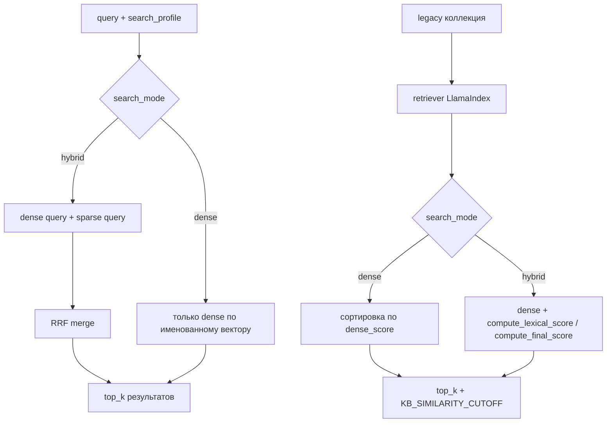
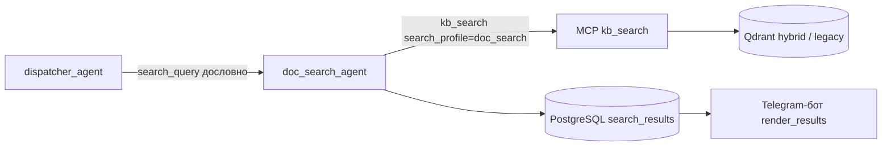

# Release notes: гибридный поиск Qdrant, профили `kb_search` и подготовка запросов `doc_search`

**Дата:** 2026-05-15  
**Ветка:** `kb_search_ways`  
**Область:** индексация и поиск в Qdrant (`kb-manager`, MCP `kb_search`), агенты `doc_search_agent` / `kb_answer_agent`, промпты в `kb_storage/prompts`.

---

## Кратко

1. **Гибридный поиск в Qdrant** — для новых hybrid-коллекций: dense-вектор + sparse BM25 (`fastembed` / `Qdrant/bm25`), слияние выдачи через **RRF** (Reciprocal Rank Fusion).
2. **Профили поиска** — аргумент MCP `search_profile` (`default` | `doc_search` | `kb_answer`) задаёт режим `hybrid` / `dense` и параметры RRF; агенты передают профиль явно.
3. **Индексация без текста** — изображения и пустые файлы попадают в индекс (заглушка + путь/имя в sparse), чтобы `doc_search` находил файлы по имени и папкам.
4. **Промпт `doc_search_agent`** — расширены правила нормализации `query` для `kb_search` (типы материалов, канон названий продуктов, спецпапки, релевантность по `FILE_NAME` / `RELATIVE_PATH`).
5. **Legacy-коллекции** — для коллекций без sparse в Qdrant через тот же `search_profile` выбирается **`dense`** (только скор retriever) или **`hybrid`** (dense + пост-лексический скор по контенту и метаданным) поиск; логика вынесена в `rescore_legacy_retriever_nodes`.
6. **kb-manager: FAQ при создании** — по типу в `collections_config` / `collection_type` и по полю **`type`** в API коллекции FAQ создаются в **legacy**-схеме (один dense-вектор), коллекции документов — **hybrid**.
---

## 1. Гибридный поиск в Qdrant

### Схема коллекции

Новые коллекции типа kb (FAQ остаются по старому, только с dense) создаются с **именованными** векторами:

| Имя | Назначение |
|-----|------------|
| `dense` | Семантический embedding (как раньше) |
| `sparse` | Sparse BM25 (`SparseVectorParams`, modifier IDF) |

**Файлы:** `mcps/mcp-server-kbsearch/app/utils/qdrant_hybrid.py`, `mcps/kb-manager/app/utils/qdrant_hybrid.py` (общая логика).

Функция `collection_hybrid_mode()` возвращает `hybrid` или `legacy` — старые коллекции без sparse продолжают работать по прежнему пути.

### Индексация (upsert)

При `hybrid`-коллекции для каждого чанка:

- **dense** — embedding текста чанка;
- **sparse** — BM25 по строке из `bm25_document_text(chunk_text, section_path, source_name)`:
  - тело чанка;
  - путь папок и **имя файла** (для лексического матча по каталогу).

**Файлы:** `mcps/mcp-server-kbsearch/app/utils/indexer.py`, `mcps/kb-manager/app/services/qdrant_service.py`.

### Поиск (MCP `kb_search`)



| Режим | Когда | Поведение |
|-------|--------|-----------|
| `hybrid` | hybrid-коллекция + `search_mode=hybrid` | Два запроса в Qdrant (`dense`, `sparse`), fusion через `reciprocal_rank_fusion` |
| `dense` | hybrid-коллекция + `search_mode=dense` | Только dense по `dense` (sparse в запросе не участвует) |
| legacy | коллекция без sparse | Retriever как раньше; затем **`rescore_legacy_retriever_nodes`**: при `search_mode=dense` — только dense; при `hybrid` — смешение dense и пост-лексического скора (`compute_lexical_score` / `compute_final_score`), порог `KB_SIMILARITY_CUTOFF` |

### Legacy-коллекции и `search_profile`

Если `collection_hybrid_mode` ≠ `hybrid`, MCP не вызывает Qdrant sparse/RRF, а идёт по ветке **fallback** в `mcp-server-kbsearch_v2.py`:

1. `candidate_k = max(top_k * 5, 30)` — расширенный пул кандидатов из retriever.
2. `rescore_legacy_retriever_nodes(nodes, query, profile_cfg.search_mode, top_k, …)` — единая точка переранжирования:
   - **`dense`** — `final_score = dense_score` узла;
   - **`hybrid`** (любое значение `search_mode`, кроме `dense`) — лексический вклад по запросу, `source`, `section_path` и штраф `low_info_penalty` для короткого/шумного контента.
3. В ответ попадают только узлы с `final_score >= KB_SIMILARITY_CUTOFF` (по умолчанию из env, см. `SIMILARITY_CUTOFF` в сервере).

Так **`kb_answer`** (dense) и **`doc_search`** (hybrid по умолчанию) остаются осмысленными и на старых коллекциях до миграции на hybrid Qdrant.

**RRF:** `mcps/mcp-server-kbsearch/app/utils/rrf.py` — `score(d) = Σ 1/(k + rank_i(d))`.  
Параметры `k` и размер пула кандидатов (`fetch = top_k × candidate_mult`) берутся из профиля (см. ниже).

**Зависимость:** `fastembed` (sparse BM25), переменная `SPARSE_BM25_LANGUAGE` (по умолчанию `russian`).

> **Важно:** гибридный поиск работает только на коллекциях, созданных/переиндексированных в hybrid-режиме. После обновления нужна **переиндексация** активной коллекции документов.

### kb-manager: какие коллекции в какой схеме

**Файл:** `mcps/kb-manager/app/services/qdrant_service.py`

| Тип в `collections_config` | Создание коллекции |
|------------------------------|-------------------|
| Документы (`CollectionType.DOCUMENTS`) | `hybrid_collection_create_kwargs` — `dense` + `sparse` |
| FAQ (`CollectionType.FAQ`) | Один `VectorParams` (legacy), совместимость с `mcp-server-faq` (LlamaIndex без `vector_name`) |

- **`ensure_collections`** — схема по значению типа в `collections_config` для каждого имени коллекции.
- **`ensure_collection`** (старт сервиса) — схема по `collection_type`, согласованному с `QDRANT_COLLECTION` через `COLLECTIONS_CFG` в `main.py`.
- **`create_collection(..., schema_kind="faq"|"kb")`** — схема только по явному `type` из API (`POST /api/collections/create`).

**Если коллекция с таким именем уже есть в Qdrant**, она не пересоздаётся автоматически.

---

## 2. Профили поиска: `doc_search` и `kb_answer`

### MCP

Инструмент `kb_search` (`mcps/mcp-server-kbsearch/app/mcp-server-kbsearch_v2.py`) принимает:

```text
search_profile: "default" | "doc_search" | "kb_answer"
```

Нормализация и пресеты: `mcps/mcp-server-kbsearch/app/utils/search_profile.py`.

| Профиль | Кто передаёт | `search_mode` (default) | `rrf_k` (default) | `candidate_mult` (default) |
|---------|----------------|-------------------------|-------------------|----------------------------|
| `default` | не указан / прочие вызовы | `hybrid` | 60 | 100 |
| `doc_search` | `doc_search_agent` | `hybrid` | 40 | 120 |
| `kb_answer` | `kb_answer_agent` | `dense` | 60 | 10 |

Для **`doc_search`** по умолчанию включён гибрид с более широким пулом кандидатов (лучше находить файлы по имени и лексике).  
Для **`kb_answer`** по умолчанию **только dense** — ответ строится по смыслу фрагментов FAQ/KB, без смешивания с BM25.

### Переменные окружения

| Переменная | Профиль | Назначение |
|------------|---------|------------|
| `KB_DEFAULT_SEARCH_MODE` | default | `hybrid` \| `dense` |
| `KB_HYBRID_RRF_K` | default | RRF `k` |
| `KB_HYBRID_CANDIDATE_MULT` | default | множитель кандидатов |
| `KB_SEARCH_MODE_DOC_SEARCH` | doc_search | режим поиска |
| `KB_RRF_K_DOC_SEARCH` | doc_search | RRF `k` |
| `KB_CANDIDATE_MULT_DOC_SEARCH` | doc_search | множитель кандидатов |
| `KB_SEARCH_MODE_ANSWER` | kb_answer | режим поиска |
| `KB_RRF_K_ANSWER` | kb_answer | RRF `k` |
| `KB_CANDIDATE_MULT_ANSWER` | kb_answer | множитель кандидатов |

### Агенты и промпты

| Компонент | Изменение |
|-----------|-----------|
| `doc_search_agent` | В fallback и `kb_storage/prompts/doc_search/doc_search_agent_prompt.md`: обязательный `search_profile="doc_search"` |
| `kb_answer_agent` | В fallback и `kb_storage/prompts/kb_answer/kb_answer_agent_prompt.md`: обязательный `search_profile="kb_answer"` |
| `dispatcher_agent` | Для `route=doc_search` поле `search_query` — **дословная копия** последнего сообщения; нормализация под поиск — у `doc_search_agent` |

---

## 3. Индексация файлов без извлекаемого текста

Раньше файлы без текста (изображения без OCR, пустые документы) могли **не попадать** в индекс.

Теперь в `document_loader`:

- **Изображения** (`.png`, `.jpg`, `.jpeg`, `.gif`, `.webp`, `.bmp`, `.tif`, `.tiff`, `.svg`, `.ico`) — один чанк с текстом-заглушкой `"пусто"`;
- **Любой файл** с пустым извлечённым текстом — тоже `"пусто"`, но точка в Qdrant создаётся.

В hybrid-режиме sparse-индекс строится по **пути и имени файла** (`bm25_document_text`), поэтому запросы вроде «сториз Fort Knox» или «презентер Альфа Kids» могут находить такие файлы даже без OCR.

**Файлы:**

- `mcps/mcp-server-kbsearch/app/utils/preprocessors/document_loader.py`
- `mcps/kb-manager/app/utils/preprocessors/document_loader.py`

---

## 4. Промпт `doc_search_agent`: подготовка запросов к `kb_search`

**Файл:** `kb_storage/prompts/doc_search/doc_search_agent_prompt.md`

Основные дополнения относительно предыдущей версии:

| Блок | Содержание |
|------|------------|
| Вызов `kb_search` | Явный `search_profile="doc_search"`; режим hybrid/dense агент не задаёт |
| Типы материалов | Сториз/сторис, презентер, мобильный презентер, презентация, ПФ, клиники, чекап, FAQ — **сохранять лексику** в `query`, не заменять на англ. обобщения |
| Названия продуктов | Канон как в дереве материалов (Fort Knox, Unit Linked, НСЖ, АльфаЗдоровье, …); таблица опечаток → канон |
| Спецпапки | `2 В фокусе АСЖ`, `3 Налогообложение 2026`, `4 О компании`, `5 Архив` — фильтр `section_path` при уверенности |
| Примеры нормализации | «For Knox сториз» → `Fort Knox сториз`, «юнит линкед двойной доход» → `Unit Linked Двойной доход`, … |
| Релевантность | Учитывать `FILE_NAME` и `RELATIVE_PATH`, даже если в TEXT темы нет; приоритет явно запрошенного типа файла |
| Комментарии к файлам | Краткий `snippet` по найденному контексту, без «ответа на вопрос» вместо описания документа |

Диспетчер для doc_search больше **не сжимает** запрос — агент сам переформулирует `query` для семантического и лексического поиска, не теряя продукт и тип материала.

---

## Цепочка (связь с doc_search UI)

Изменения **не меняют** контракт оркестратора и бота (см. [release_notes_doc_search_orchestrator.md](./release_notes_doc_search_orchestrator.md)):



Улучшается качество **первичной выдачи** из Qdrant и отбор документов агентом; пагинация, «ещё» / «все» и скачивание по рангу — как раньше.

---

## Тесты и проверка после выката

| Что | Где |
|-----|-----|
| RRF | `tests/unit/mcps/test_rrf.py` |
| Профили `search_profile` | `tests/unit/mcps/test_search_profile.py` |
| `qdrant_hybrid` (BM25-текст, hybrid/legacy, meta-точка) | `tests/unit/mcps/test_qdrant_hybrid.py` |
| Индексатор: hybrid RRF / dense-only (без полного импорта `llama_index`) | `tests/unit/mcps/test_indexer_hybrid_search.py` |
| `DocumentLoader`: изображения и пустые файлы | `tests/unit/mcps/test_document_loader_non_text.py` |
| Legacy fallback переранжирование | `tests/unit/mcps/test_mcp_kbsearch_legacy_fallback.py` |
| Промпты и fallback агентов (`search_profile`, диспетчер) | `tests/unit/mcps/test_kb_search_hybrid_integration.py` |
| Диспетчер / валидация doc_search | `tests/unit/agent/test_dispatcher_agent.py` |

Вспомогательный импорт kbsearch-модулей без конфликта с корневым пакетом `utils`: `tests/unit/mcps/kbsearch_import_helper.py`.

**Рекомендуемый smoke-тест:**

1. Переиндексировать активную коллекцию документов (hybrid).
2. `doc_search`: «файлы сториз Fort Knox», «презентер Альфа Kids» — файлы в выдаче, в т.ч. без текстового слоя.
3. `kb_answer`: содержательный вопрос по продукту — ответ из FAQ/KB, без деградации из-за лексического шума.
4. При необходимости подкрутить env-профили (`KB_SEARCH_MODE_*`, `KB_RRF_K_*`, `KB_CANDIDATE_MULT_*`).

---

## Итог по ответственности

| Компонент | Что делает |
|-----------|------------|
| **kb-manager / indexer** | Hybrid upsert для **документных** коллекций; **FAQ** — legacy-схема при создании коллекции; индекс «пустых» и картинок, BM25 по пути и имени для KB |
| **MCP `kb_search`** | Выбор dense / hybrid+RRF по `search_profile` на hybrid-коллекциях; на legacy — `rescore_legacy_retriever_nodes` с тем же `search_mode` |
| **`doc_search_agent`** | Нормализация `query`, `search_profile=doc_search`, JSON для БД |
| **`kb_answer_agent`** | FAQ + при необходимости KB с `search_profile=kb_answer` |
| **`dispatcher_agent`** | Маршрут; для doc_search — сырой `search_query` |
| **Бот** | Без изменений в UX списка и follow-up |
